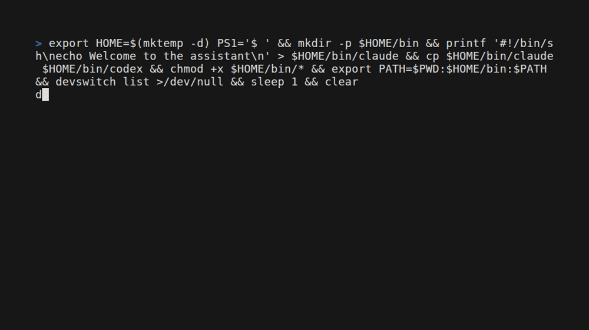

# devswitch

> Use your work and personal AI accounts on the same computer, without logging out. · by RBen19

devswitch lets you keep several accounts for **Claude Code**, **Codex** and **Gemini CLI** side by side —
for example a personal account and a work account — and open the one you need with a single command.
Each account keeps its own login and its own conversations.



## Get started in 3 steps

1. **Install** — open the Terminal app, paste this line and press Enter:

   ```bash
   curl -fsSL https://github.com/RBen19/devswitch/releases/latest/download/install.sh | bash
   ```

   It asks a few yes/no questions. Pressing Enter accepts the safe default.
2. **Add an account** — give it any name you like:

   ```bash
   devswitch add claude work
   devswitch login claude work
   ```

   The official Claude, Codex or Gemini login opens. devswitch never sees your password.
3. **Use it** — open that account whenever you need it:

   ```bash
   devswitch run claude work
   ```

   Open a second Terminal window to use another account at the same time.

Already logged in before installing devswitch? Setup offers to keep that login as your `personal` account.

## Words you will see

| Word | Meaning |
| --- | --- |
| Terminal | The app where you type commands (Terminal on macOS; Terminal or Console on Linux). |
| Profile / account | One login for one AI, with a name you choose, like `work` or `personal`. |
| Provider | The AI tool: `claude` (Claude Code), `codex` (Codex) or `gemini` (Gemini CLI). |
| PATH | The list of places your computer looks for commands. Setup handles it for you. |

## Questions

**Will I lose my current login?** No. Setup can keep your existing login as an account; nothing is logged out.

**Does devswitch see or store my password?** No. Logging in happens in the official Claude, Codex or Gemini window. devswitch only tells each tool which folder to use.

**It says the AI "isn't installed yet".** devswitch opens these tools but does not install them. Follow the link in the message, then try again.

**It says there is "no account named …".** Check the spelling; the message lists the accounts you have. `devswitch list` shows them all.

**Can I undo everything?** Yes: `devswitch uninstall` removes the shell setup; add `--purge` to also delete the accounts devswitch created.

**Does it work on Windows?** Not yet. macOS and Linux are supported today.

---

# For developers

## Why devswitch exists

Developers often use more than one account with the same coding assistant: a personal account, a work account, or separate accounts for different clients and organizations. Most provider CLIs keep one active login and one shared configuration directory by default. Switching accounts manually can log out the previous account, mix sessions and settings, or require repetitive environment-variable commands.

devswitch solves this by giving every provider account a named local profile. By default, each profile gets its own configuration directory, authentication state, sessions, and provider-specific settings. You can optionally share sessions and reusable agent files between profiles of the same provider. You can then launch the exact account you need with one predictable command:

```bash
devswitch run claude work
devswitch run codex personal
devswitch run gemini work
```

The project is intentionally a lightweight profile manager, not a replacement for Claude Code, Codex, or Gemini CLI. It does not automate provider login pages or handle credentials; it prepares the correct environment and lets the official CLI complete authentication securely.

## Install

Supported platforms: macOS and Linux, on `arm64` or `amd64`. No Go installation or administrator privileges are needed for release binaries.

```bash
curl -fsSL https://github.com/RBen19/devswitch/releases/latest/download/install.sh | bash
```

The installer selects your platform, downloads a pinned release archive, verifies its SHA-256 checksum, checks that the binary runs, and atomically installs it into `~/.local/bin`. It then starts guided setup. Run the same command again to upgrade. Failed downloads and verification leave an existing binary untouched. Checksums detect corruption; they are distributed through the same GitHub release as the binaries, not an independent signature.

For automated or controlled installations:

```bash
curl -fsSL https://github.com/RBen19/devswitch/releases/latest/download/install.sh -o install.sh
# Inspect the script, then choose an exact version and installation directory:
bash install.sh --version v0.2.0 --install-dir "$HOME/.local/bin" --shell zsh
# Install the binary only:
bash install.sh --version v0.2.0 --no-setup
```

`DEVSWITCH_VERSION` and `DEVSWITCH_INSTALL_DIR` also set these defaults. Without an interactive terminal, setup accepts its documented defaults. `--no-setup` leaves shell files untouched. The installer requires Bash, curl, tar, and either `sha256sum` or `shasum`.

### Build from source

Requires Git and Go 1.26 or newer:

```bash
git clone https://github.com/RBen19/devswitch.git
cd devswitch
make build
./devswitch install
```

Install the official `claude`, `codex`, or Gemini CLI (`agy`) separately. devswitch discovers them through `PATH`; it does not download providers or handle their credentials.

## Setup once

```bash
devswitch install                     # also available as devswitch setup
devswitch install --shell zsh --yes   # accept defaults without prompts
```

Setup performs the following steps:

1. Detect your shell and install PATH integration plus tab completion.
2. Detect Claude Code, Codex, and Gemini CLI binaries and existing default configuration directories.
3. Offer to adopt existing configurations as `personal`, preserving the login. Already-adopted homes are skipped; name conflicts receive an actionable message.
4. Ask, per provider (default No), whether to share sessions, memory, skills and agents of `personal` with every other profile, now and for future ones. Existing profiles are merged in (see [Share](#share-data-between-profiles-of-the-same-provider)).
5. Offer the `dvsw` shortcut and optional named profile shortcuts such as `cx-personal`.

`--yes` enables completion, adopts detected configurations when `personal` is available, and adds `dvsw`; it never enables sharing. Additional per-profile aliases are offered only during interactive setup, or can be added anytime. Setup runs once per shell: running it again, including through the curl installer on update, only refreshes the shell integration.

Open a new terminal after setup, or run the `source` command it prints. Bash setup handles both interactive and login shells. Zsh honors `ZDOTDIR`; Fish honors `XDG_CONFIG_HOME`. Setup updates delimited blocks, preserves other shell content and symlinked dotfiles, and upgrades the previous devswitch PATH block. Existing shell commands and aliases take precedence over generated aliases.

Tab completes providers, registered profile names, subcommands, and flags. For example, type `devswitch run codex ` and press Tab to see your Codex profiles. Completion is also configured for aliases of the main devswitch command. Profile launcher aliases pass subsequent arguments to the provider; provider-specific flag completion is not generated by devswitch.

## Your shortcuts

```bash
devswitch alias add ds                 # ds runs devswitch
devswitch alias add work-ai codex work # work-ai launches this profile
devswitch alias list
devswitch alias remove work-ai
```

Alias changes refresh all shells configured by setup. Open a new terminal to load additions. Removal also prints an `unalias` command for your current terminal. Names cannot replace reserved commands or executables already in PATH.

The built-in shortcuts work with or without shell aliases:

```bash
devswitch cx work -- --full-auto
devswitch cl personal
dvsw cx w       # w means work; p means personal
```

## Diagnose and automate

```bash
devswitch discover       # binaries, existing homes, and registered profiles
devswitch doctor         # profile directories, broken links, shell integration, completion
devswitch discover --json
devswitch list --json
devswitch doctor --json
```

`doctor` exits nonzero when a required check fails. A missing unused provider is fine when another provider is installed. Provider launches preserve the provider's exit code. JSON commands write data to stdout and errors to stderr; normal help contains no decorative banner.

## Uninstall

```bash
devswitch uninstall          # remove managed PATH, completion, and aliases
devswitch uninstall --purge  # also permanently delete managed profiles and backups
```

Uninstall cleans all shells recorded by setup and leaves unrelated shell configuration intact. Without `--purge`, profiles and saved alias preferences remain available for reinstalling. The binary is not deleted automatically; the command prints its location. Open a new terminal afterward.

## Create and use profiles

### Adopt an existing configuration

If Claude Code, Codex, or Gemini CLI was already installed and logged in before devswitch, discover it first:

```bash
devswitch discover
```

If an existing configuration is found, assign it a profile name that describes the account or workspace:

```bash
devswitch adopt claude personal
devswitch adopt codex personal
```

Adoption reuses the existing configuration in place. It does not copy or move files, and it does not require logging in again. Choose `work`, `client-a`, or another name instead of `personal` when that better describes the account.

Confirm the result and launch the adopted profiles:

```bash
devswitch list
devswitch run claude personal
devswitch run codex personal
```

### Create a fresh isolated profile

Create one profile per account or workspace:

```bash
devswitch add claude personal
devswitch add claude work
devswitch add codex personal
devswitch add codex work
```

`add` creates a new isolated configuration directory. It is the right command when you want a new account/workspace profile rather than adopting the provider's existing default configuration.

Authenticate a profile through the provider's official flow:

```bash
devswitch login claude personal
```

For Claude Code, type `/login` in the launched session. For Codex, the official browser login flow starts with `codex login`.

Run a provider with a selected profile:

```bash
devswitch run claude work
devswitch run codex personal
```

You can run different profiles at the same time in separate terminals. Pass arguments to the underlying CLI after `--`:

```bash
devswitch run codex work -- --full-auto
```

Shortcuts are available after `devswitch install` and a shell reload:

```bash
dvsw cl p       # devswitch run claude personal
dvsw cl w       # devswitch run claude work
dvsw cx p       # devswitch run codex personal
dvsw cx w       # devswitch run codex work
```

## Share data between profiles of the same provider

Close the affected agents, then choose a source profile and one or more existing target profiles:

```bash
devswitch share codex personal work --dry-run
devswitch share codex personal work
devswitch share claude personal work client-a

# Share just skills and agent definitions/instructions
devswitch share claude personal work --only skills,agents
```

Targets receive symlinks pointing to the source profile's data. Changes through either profile are shared. Codex links only to Codex; Claude links only to Claude. Adopted profiles also work as sources or targets. New profiles remain isolated until you run `share` for them, unless sharing was enabled during setup; then `add` and `adopt` link them automatically, and `--no-share` keeps one isolated.

By default, all five categories below are selected. Use `--only` with a comma-separated list to narrow them:

| Category | Codex paths | Claude paths |
| --- | --- | --- |
| `sessions` | `sessions/`, `archived_sessions/`, `history.jsonl`, `session_index.jsonl`, `state_5.sqlite` | `projects/` (including project memory), `history.jsonl`, `file-history/`, `tasks/`, `plans/` |
| `skills` | `skills/` | `skills/` |
| `agents` | `agents/`, `AGENTS.md`, `AGENTS.override.md` | `agents/`, `agent-memory/`, `CLAUDE.md` |
| `rules` | `rules/` | `rules/` |
| `commands` | `prompts/` | `commands/` |

Missing directories and JSONL files are initialized in the source. Instruction files are linked only if they already exist; rerun `share` after adding them. Repeating the command leaves existing links alone.

Existing target paths are renamed to `<path>.devswitch-backup` (with a numeric suffix if needed). Their contents are first merged into the shared data: missing files and folders are copied, JSONL histories are appended, and on a name clash the source's file wins while the target's version stays in the backup. The backup keeps the complete original. The command prints every link and backup path. `--dry-run` makes no filesystem changes. If linking fails, completed replacements are rolled back.

Credentials, provider settings (`config.toml`, `settings.json`), plugins and caches remain per-profile. SQLite databases also stay per-profile, except Codex's thread list `state_5.sqlite`, which is shared with `sessions` so shared conversations appear in Codex's picker; its threads are merged with the target's when sharing starts (requires the `sqlite3` command). Custom paths configured in provider settings are not discovered. Codex agent definitions that require entries in `config.toml` still need those entries in each profile. User-wide skills outside the profile home are already independent of devswitch.

Keep the source profile in place while its links are in use. To undo sharing, close the agents, remove the target symlink, and rename its printed backup back to the original path (or create a new empty directory/file if there was no backup). Removing a symlink does not delete its source data. `uninstall --purge` deletes managed source profiles and backups too, so adopted profiles pointing into them would be left with broken links.

Storage references: [Codex configuration and state](https://learn.chatgpt.com/docs/config-file/config-advanced), [Claude directory layout](https://code.claude.com/docs/en/claude-directory).

## Storage and isolation

Profiles are stored under the current user's home directory:

```text
~/.devswitch/profiles/claude/personal
~/.devswitch/profiles/claude/work
~/.devswitch/profiles/codex/personal
~/.devswitch/profiles/codex/work
```

The registry is stored in `~/.devswitch/profiles.json`; shell preferences are in `~/.devswitch/shell.json`. Registry and shell updates use atomic file replacement and process locks. Profile names cannot escape the storage directory. The paths are resolved at runtime; devswitch does not assume a specific username, home directory, or project location.

Existing Claude Code, Codex, and Gemini CLI installations remain unchanged unless you explicitly share data into an adopted profile. If a provider CLI is missing, devswitch reports that it must be installed first. Existing profiles are never overwritten by `devswitch add`.

## Development commands

```bash
make build
make test
go test -race ./...
go vet ./...
python3 scripts/test_installer.py
```

`make install` uses Go to install the binary into Go's user bin directory. For a source installation, you may then add that directory to `PATH` with:

```bash
export PATH="$(go env GOPATH)/bin:$PATH"
```

## Contributing

Contributions are welcome. Before opening a pull request:

1. Create a focused branch for your change.
2. Keep the CLI behavior and user-facing messages documented in English.
3. Add or update tests, including an E2E test when the change affects a user workflow.
4. Run the complete local checks:

   ```bash
   go test ./...
   go vet ./...
   git diff --check
   ```

5. Update the README when adding or changing commands.
6. Open a pull request with a clear description of the problem, solution, and verification steps.

Please do not include credentials, provider tokens, local profile directories, or generated binaries in commits.

## Deliberately limited scope

- no credential scraping or token management;
- no provider account API calls;
- no background daemon;
- no automatic email or verification-code handling;
- no automatic installation of Claude Code, Codex, or Gemini CLI.

## Release process

See [the release checklist](docs/releasing.md). CI tests the compiled CLI and shell workflows on Linux and macOS. Successful pushes to `master` automatically get the next patch tag (`v0.2.0`, `v0.2.1`, …) after CI passes. The shared release workflow packages all four platforms, verifies uploaded assets in a temporary draft, then publishes automatically. Pull requests and other branches run checks without creating tags. Manual version tags and release retries use the same workflow. Published assets are never overwritten.
